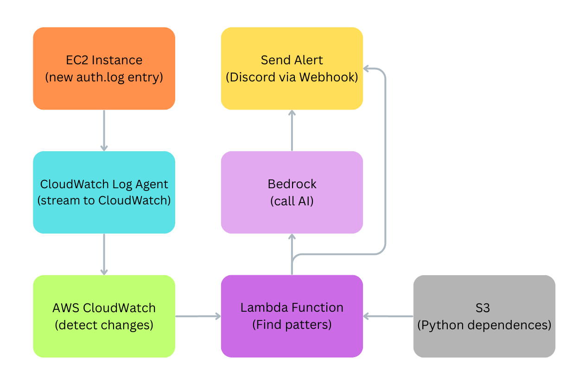

# AWS EC2 CloudWatch Agent

## Objective:

This project is to experiment and understand AWS services; CloudWatch, Lambda Function, S3 and Bedrock. The main objective is to create a AI agent for security purpose in mind by monitoring log files and potentially basic actions like blocking IP address.

The first thing I started with was experimenting with and learning about CloudWatch Agent. After I set up a log group and stream that connects my EC2 instance to the AWS CloudWatch management console, I then moved on to Lambda functions. This service can trigger a script when a log file updates. The script reads the file and then searches for patterns for security concerns. If a pattern is detected, it calls Bedrock to ask the AI to generate a summary and other information in JSON format, which will be used as a message to send to a Discord channel via a webhook URL. During the process, I also learned about S3, which I used to store Python dependencies for the script to run. Below is a diagram to illustrate how each service is connected. Lastly, I have also attached three Markdown documents for the setup process for each services, besides Bedrock.



A diagram to illustrate how the AI Agent is structured using various AWS services as of 3/9/26. 


1. [CloudWatch](CloudWatch.md): Documentation how I setup CloudWatch on Ubuntu and AWS console

2. [WizardSetup](WizardSetup.md): Table showing the options I chose when setting up CloudWatch Agent

3. [Lambda Function & S3](Lambda_Function_&_S3.md): Documentation how I setup Lambda Function and S3 to work with CloudWatch

Note: The instance image I used is Ubuntu. Thus, the process of installing AWS CLI or the CloudWatch agent is a bit different: requires downloading a package first (.deb). Additionally, instead of `yum`, it's `apt` to install packages.

<hr>

## Terminologies:

<u>CloudWatch</u> is a service that collects monitoring data from servers/apps. There are 4 services it provides: Logs (text output from applications/systems), metrics (numerical data (CPU %, disk usage, request counts)), events (alerts/triggers (when something happens)) and dashboards, a visual monitoring. 

<u>Lambda Function</u> is a serverless compute that runs script/code when triggered by a event and stops automatically.

<u>S3 (Simple Storage Service)</u> is a bucket that is a container that stores files. Each bucket have unique names, can hold many-many files and files is organized by keys.

<u>Bedrock</u> is a cloud service that allows the use of foundation models via API to develop applications without managing the AI infrastructure.  

<hr>

## Repository Setup:

### 1. Clone Repository:

```bash
git clone https://github.com/ProximaSF/Security-Monitor-AI-Agent.git
```

### 2. Setup .venv:

```bash
python -m venv .venv
.venv/Scripts/activate # Powershell
source ".venv/bin/activate" # Bash
```

### 3. Install Required Dependence:

```bash
pip install -r ./requirements.txt
```

### 4. Add .env File for `test.py`

```bash
mkdir .env
```

- Inside .env, add these two environment variables: `WEBHOOK_URL` & `AWS_BEARER_TOKEN_BEDROCK`

  ```markdown
  WEBHOOK_URL=...
  AWS_BEARER_TOKEN_BEDROCK=...
  ```

  - `WEBHOOK_URL`: Discord Webhook URL 
  - `AWS_BEARER_TOKEN_BEDROCK`: AWS Bedrock API token

### 5. Add auth.log file sample

```bash
mkdir auth.log
```

- You will need to populate the data. Use AI to provide a sample or your own. 

<hr>

## Script Explanation:

### Global Variables:

There are 3 global variables: `WEBHOOK_URL`, `FAILED_ATTEMPT_THRESHOLD` & `TIME_WINDOW_SECONDS`

- `WEBHOOK_URL`: is assigned to a environment variables stored on AWS Lambda management system 
- `FAILED_ATTEMPT_THRESHOLD`: Is the number failed login attempts before it triggers a alert
- `TIME_WINDOW_SECONDS`: The time frame (2 minutes) which consist of failed login attempts

### analyze_with_bedrock():

Sends a detected threat (log message, type, and severity) to AWS Bedrock's Claude model and asks it to analyze the threat. It returns a JSON response containing a summary, likely attack type, recommended action, and extracted IP address.

### webhook_embed():

Builds and sends a formatted Discord embed message to a Discord Channel via Webhook URL. These message consist of security alerts or errors.

### analyze_auth_log():

Scans `auth.log` for keywords associated with known threat types (e.g. failed logins) and returns a threat object with its type, severity, and color if a match is found.

### check_threshold_in_window():

Uses a sliding window algorithm to check whether a minimum number of events occurred within a given time range, returning the triggering events if the threshold is met.

- Mostly written by AI

### lambda_handler():

The main AWS Lambda handler that decodes and decompresses incoming CloudWatch log data, identifies suspicious events, groups them by threat type, and triggers Bedrock AI for analysis and Discord alerts when thresholds are meet.

- Partially contain AI written codes:
  - try-except logic, compress data, handle incoming data and alert trigger threshold

<hr>

## Possible Future Improvement Check List

- [x]  Integrate Bedrock for custom AI response
- [x]  Add more threat detection conditions/logic
- [x]  Optimize script for AI agent
- [ ]  Automatically block IP Address after # failed attempts
- [ ]  Store Lambda result to S3 
- [ ] Integrate SSM for convince and security
- [ ] Add more lambda functions for other purpose
- [ ] Provide instruction/process how to install dependences without using S3
- [ ]  Land a job :D

